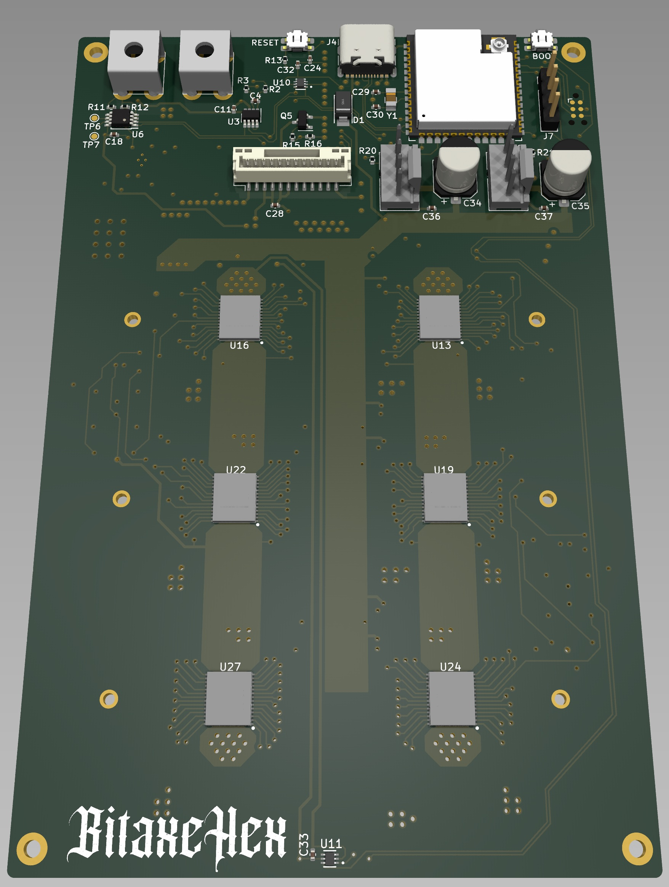

> Closed Source is Antithetical to Bitcoin

# Presenting: The bitaxeHex
bitaxeHex is a follow on to the [bitaxe](https://github.com/skot/bitaxe) that incorporates six BM1366 ASICs from the Antminer S19XP

## Goals
- **Standalone**: can mine directly to your pool over WiFi. No External computer needed.
- **Embedded**: low cost, low maintenance, high availability, high reliability, low power.
- **ASIC**: based on the very efficient BM1366 from Bitmain.
- **Versatile**: solo/pool mining, autotune power/heat/efficiency.
- **Open Source**: All design files are provided.

## Features
- **ESP32-S3-WROOM-1** wifi microcontroller on board
- **TI TPS40305** buck regulator steps down the 5V input to power the chain of BM1366
- **Maxim DS4432U+** current DAC digitally adjusts the BM1366 core voltage
- **TI INA219** power meter measures the input voltage and current of the miner
- **TMP1075** measures inlet and outlet PCB temperature.
- **Microchip EMC2302** Controls dual fans
- Header for optional status LCD

## BM1366
- The BM1366 is a undocumented SHA256 mining ASIC from Bitmain. It's mostly used in the Antminer S19XP and S19K Pro
- Bitmain claims the BM1366 has 21.5 W/TH efficiency
- The BM1366 is available (new) for around $15 each.

## Current Status
- v302 hardware is working! Hash rate is fluctuating between 2.4 TH/s and 3.0 TH/s.
- Power draw is around 50W @12V.
- ESP32 miner firmware will configure the power supply to run at the proper voltage.
- This is an _advanced_ build! If you don't have experience building boards, you should probably go build a single ASIC bitaxe first to get the technique down.

## Revision List
- V302 is the current working version of this board.  If you want to build this, pull down this git tag.
- V301 does not work, the power supply maintains voltage, but overheats in a drastic way
- V301 does not work, the power supply cannot maintain voltage when a load is applied

## Hardware
- [BM1366 from NBTC on AliExpress](https://www.aliexpress.us/item/3256803471845503.html). Both the `AL` and `AG` variants have been known to work.
- [Heatsink](https://www.aliexpress.us/item/3256805608902122.html) 90mm long variant. This will need to have threaded mounting holes added.
- [Fans](https://www.amazon.com/Noctua-NF-A8-PWM-Premium-Quiet/dp/B00NEMG62M) At least one 80x80mm 12V 4-pin fan. Like the Noctua NF-A8 PWM. Possibly two.
- [Enclosure](https://www.aliexpress.us/item/3256804293159109.html) 130mm long variant. The bitaxeHex needs to be run inside an enclosure to force air through the heatsink and effectively cool the BM1366s
- All of the parts on the board are listed in the KiCad BOM

## Software
- [ESP-Miner](https://github.com/skot/ESP-Miner) is still being updated to support multiple ASICs

## Power Supply Requirements
- bitaxeHex takes 12V DC input via screw terminals. Power supply should be capable of 100W

## Building
- Check out [building.md](building.md) for PCB ordering tips
- Check out [assembly.md](assembly.md) for assembly tips
